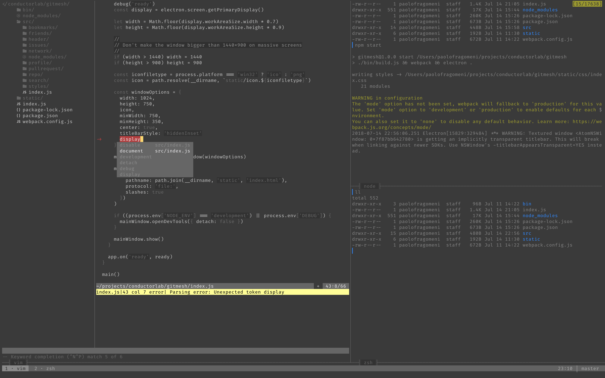

```

   ██████╗  ██████╗ ████████╗    ███████╗██╗██╗     ███████╗███████╗
   ██╔══██╗██╔═══██╗╚══██╔══╝    ██╔════╝██║██║     ██╔════╝██╔════╝
   ██║  ██║██║   ██║   ██║       █████╗  ██║██║     █████╗  ███████╗
   ██║  ██║██║   ██║   ██║       ██╔══╝  ██║██║     ██╔══╝  ╚════██║
   ██████╔╝╚██████╔╝   ██║       ██║     ██║███████╗███████╗███████║
   ╚═════╝  ╚═════╝    ╚═╝       ╚═╝     ╚═╝╚══════╝╚══════╝╚══════╝

```

# USAGE
`install.bash` is program to install.

```bash
bash ./install.bash
```

# PREVIEW


